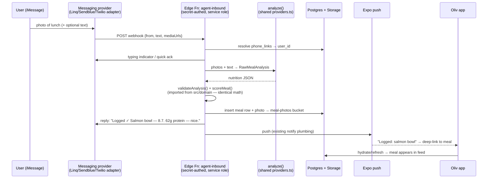

# Oliv as a texting-first health agent — research & build plan

*Researched July 23, 2026. Primary sources: illumelabs.ai (rendered site + FAQ), the Illume YC launch post + YC profile, poke.com + docs, Apple's Messages for Business docs (policy v3.1, updated July 21, 2026), Linq/Twilio/Meta provider docs — plus a fan-out research pass in which every load-bearing claim was adversarially verified against primary sources (3 independent verifiers per claim; 20 of 25 confirmed, 5 refuted and excluded). Full source list at the end.*

## TL;DR

- **Illume Labs** (YC Summer 2026, launched their waitlist **three days ago**) is exactly the product you described: a 24/7 health companion whose core UX is *"Health that texts back"* — wearable sync + **texted meal photos** + workouts + bloodwork fused into one conversational agent ("Taro"), $10/month private beta. Oliv already has the hardest piece they advertise (photo → nutrition → normative score pipeline) plus a social layer they don't have.
- **Poke** (The Interaction Company — **Cognition announced its acquisition today, July 23**) is the proven playbook for the channel question, verified end-to-end: they launched on **Twilio SMS → migrated to Linq, a commercial *unofficial* iMessage API** (single phone line → hundreds of lines at launch; 10k msgs/day within days) → and on **June 4, 2026 became the first standalone AI agent Apple ever approved onto Messages for Business** (~2 months of compliance work). ~100M messages relayed, hundreds of thousands of users, 10 people, $300M valuation.
- **Apple's official channel is real but constrained**: MSP-mediated only, **bot-only experiences are banned** (a live human escalation path during business hours is mandatory — policy v3.1, two days old), and proactive messaging is limited to consent-gated, Apple-approved templates. The gray-market APIs (Linq, Sendblue, LoopMessage) are the opposite: proactive-capable and fast to ship, with Apple-ToS risk priced in.
- **Recommendation:** run Poke's exact sequence. MVP on a commercial unofficial iMessage API behind a provider-agnostic adapter (Linq is the AI-agent-proven vendor; Sendblue/LoopMessage as quote comparisons), SMS fallback from day one, then graduate to Apple Messages for Business once there's traction — Poke proved an AI agent can get approved.
- **Oliv's backend is already ~70% of the way there.** The analyze edge function, service-role insert pattern, shared-secret webhook auth, Expo push plumbing, and a pure-TS scoring domain that runs unchanged in Deno mean the MVP is roughly *one new edge function + one migration + a linking screen* (§5–7).

---

## 1. Why this direction is right

Manual logging is the reason diet apps churn. Every serious player is converging on the same insight: **the log has to come to where the user already is** — their camera roll and their Messages thread — not the other way around.

- Illume's entire pitch is *"No new app to live in. Illume works where you already are: your messages."*
- Poke demonstrated a consumer AI product can live entirely inside iMessage and grow virally (zero-install onboarding, screenshot-able personality).
- Oliv's differentiator vs. both: a **real product behind the thread** — normative health score, streaks, goals, and a social feed. The agent isn't the whole product; it's the lowest-friction *front door* into one that already exists.

The end-state you described (dietician → trainer → full health agent) is Illume's stated roadmap. The wedge — *"text a photo, it's logged before you've finished eating"* — is the part to win first, and the window is open: Illume is still waitlist-only.

## 2. Track A — Illume Labs teardown

**What it is.** "A 24/7 AI personal health & longevity companion that connects your wearables, blood panels, and genomic data to text you personalized and actionable insights." Tagline: *"A new lens on longevity."* YC **Summer 2026** batch, founded 2026, team of 3, Boston. Launch post went up **July 20, 2026**.

**Product surface (from the rendered site):**

| Capability | Their copy |
|---|---|
| Wearable sync | "Sleep, activity, and recovery flow in automatically." |
| **Meal logging by text** | "**Text photos of your meals** — Nutrition logged and understood. No forms, no barcode scans." (Verbatim on the YC profile: "Text Illume photos of your meals to log and understand your nutrition" — identical to Oliv's proposed wedge.) |
| Workouts | "Record your workouts — training load sits alongside everything else you track." |
| Bloodwork | "Upload bloodwork — lab results become biomarkers you can follow over time." (Genomics framed as future: "Eventually genetic risk.") |
| Q&A | "Ask anything — answers grounded in your own history, not generic advice." |
| Proactive insights | "What changed, what it might mean, and what to do next" — plus "daily text updates" per the YC profile. |

**How it works (their 3 steps):** (1) Connect once — wearables sync automatically, meals are photos you text. (2) "Illume connects the dots" across sleep, training, nutrition, biomarkers ("patterns no single app can see"). (3) "Text it anything… Open the platform when you want to go deep" — messaging is the primary UI; a web/app "platform" is the deep-dive surface. Their hero demo: a user texting "why am I so exhaus…".

**The agent.** Named **Taro**. "Taro, Illume's AI, learns from your connected data over time… answers conversationally, grounded in your own data." They stress "an AI system built specifically for health and longevity, not a general-purpose chatbot… The AI is not inventing numbers."

**The channel: disclosed in their privacy policy, not their marketing.** The launch post, YC profile, and site never name a channel — but [illumelabs.ai/privacy](https://www.illumelabs.ai/privacy) states verbatim: *"If you use Taro messaging, **Photon and Spectrum** process your phone number, message content, attachments, Illume's replies, and delivery metadata to deliver those messages."* So Illume rides **Photon's Spectrum** — a managed (unofficial) iMessage platform with an open-source TypeScript SDK (see §4b). The same policy reveals the rest of their stack: **Supabase** (database/storage/auth — the same backend as Oliv), **Anthropic** for AI insights (with explicit user permission), **Deepgram** for voice-memo transcription, **Terra** for wearable aggregation (plus Apple Health/WHOOP/Garmin/Fitbit/Oura), PostHog analytics (health values excluded), Stripe/Apple payments. Two of the three founders are ex-Windsurf agent engineers — the agent itself is in-house.

**Business.** Waitlist-gated **paid private beta: $10/month, 30-day money-back guarantee**. No wearable required to start. Target users per the launch post: "lifters, biohackers, and anyone already using wearables, blood panels, CGMs, nutrition trackers, or genetic testing." No human-experts-in-the-loop feature is mentioned anywhere.

**Team.** Pari Latawa (MIT CS + MolBio; Broad Institute · Eli Lilly · MD Anderson), Frank Lee (MIT CSAIL · Windsurf), Jin Wong (MIT Media Lab · Windsurf).

**Takeaways for Oliv.**
1. Their feature list is a roadmap checklist: meals-by-text first, then wearables (HealthKit is the cheap superpower on iOS), then labs.
2. $10/mo anchors consumer willingness-to-pay for exactly this product.
3. They're 3 people, pre-launch, no social features. Oliv's score + streaks + feed is a moat they'd have to rebuild.
4. Advertised capability ≠ audited performance — all Track A facts are company-authored launch copy.

## 3. Track B — Poke teardown (how the iMessage agent actually works)

**Product.** AI personal assistant with a strong personality that manages email, calendar, reminders, and 30+ integrations (Gmail, GCal, Notion, GitHub, Linear, **Oura, Strava** — it already bridges wearable data into a texting thread). Voice notes, memory, proactive "right on time" actions, shareable automation "recipes," and user-addable **MCP servers** as custom integrations (with revenue-sharing for recipe creators).

**Onboarding.** No app install: poke.com → Get Started → enter your phone number (or Telegram) → the assistant texts you. Channels per their docs: **Apple Messages, Telegram, WhatsApp, and RCS** — WhatsApp deliberately limited after **Meta barred general-purpose chatbots from WhatsApp in fall 2025** (a fact that matters for Oliv's channel table too).

**Pricing.** Free (no card) → Pro **$19/mo** → Ultra **$199/mo** (frontier models, overage pay-as-you-go). During beta they let users *negotiate the price in-chat with the agent* ($10–30/mo) — memorable, on-brand pricing discovery.

**The transport story (the thing you asked about) — verified:**

1. **They never built iMessage infrastructure themselves.** No Mac-mini fleet, no Sendblue/LoopMessage. Poke started on **Twilio** (SMS-first — their deprecated `/inbound-sms/webhook` API endpoint is the fossil), then migrated to **Linq** (linqapp.com), a venture-backed commercial *unofficial* iMessage API. Independently confirmed by TechCrunch (Apr 8, 2026): "To work over messaging platforms like iMessage, Poke also leverages Linq." Linq's case study claims a 12% retention lift from the switch (vendor-attested — treat as marketing).
2. **Scaling shape** (per Linq's case study, vendor-sourced): one phone line + small test group (April 2025) → ~20 lines → hundreds of lines right before the viral September 2025 launch; 10k messages/day within days of joining. Poke demanded **SOC 2 and zero data retention** from the vendor; Linq built ZDR support specifically for them — the exact diligence posture a health app should copy.
3. **June 4, 2026: Apple approved Poke onto Messages for Business** — the first (and as of today, apparently only) standalone consumer AI agent on the official channel. Per co-founder Marvin von Hagen it took "a couple of months" of compliance: verified **live human support fallback**, mandatory **AI self-identification**, link previews instead of inline links, Apple's UI style guide. Poke rolled it out as opt-in invites; the prior (Linq) channel kept running alongside. They pay their (unnamed) MSP **per-user**.
4. **July 23, 2026 (today): Cognition announced it is acquiring The Interaction Company.** Poke continues, moving onto Cognition's models/infra. Scale at exit: ~100M messages relayed, "hundreds of thousands" of users, 10 people, $15M seed + $10M, $300M post-money.

**Agent architecture** (from the leaked system prompt — a user got Poke to email it out in chunks, Sept 2025 — and the OpenPoke reverse-engineering teardown; behavioral inference, not insider docs):

- **Two-tier multi-agent:** a user-facing conversational **Interaction Agent** (the personality) delegates via a `sendmessageto_agent` tool to a hidden **execution engine**, which spawns parallel subagents (a `task` tool) and has browser-use capability. The user never sees the machinery — the prompt explicitly forbids revealing it.
- **Proactivity = exactly two trigger kinds:** event-based **automations** (email events) and cron-based **reminders**. Agents create/list/update/delete triggers via tools; a scheduler polls a SQL trigger table every minute, and a firing trigger *reactivates the execution agent that created it*. Notifications default to text, not email.
- **Asymmetric memory:** each execution agent keeps a full persistent log of its actions; the interaction agent's history is progressively compressed (summarization pass around a ~100-message threshold); a distilled user profile + conversation summary are injected into the prompt as tagged blocks (with a warning the memory may be inaccurate).

**Takeaways for Oliv.**
1. The channel path is now a proven sequence, not a bet: **rented gray-market iMessage → traction → official Apple approval**. You don't have to choose "legit vs. fast" permanently — you sequence them.
2. The trigger design (cron reminders + event automations, stored in SQL, firing back into an agent) maps 1:1 onto Supabase pg_cron + the existing pg_net→edge-function pattern.
3. Personality is distribution; the prompt leak is the cautionary tale — assume anything in the system prompt becomes public.
4. Web-signup-then-text onboarding removes the App Store from acquisition. Oliv can do both: the thread for capture, the app for depth (feed, progress, breakdowns).

## 4. Track C — Channel landscape: how you're allowed to text an iPhone

Five ways to run a photo-receiving, proactive texting agent for US iPhone users, with the verified constraints:

### 4a. Apple Messages for Business (the official channel)

- **Access is MSP-gated, period.** Apple FAQ (verbatim): "a company requires the services of an Apple-approved Messaging Service Provider (MSP)." Apple's side is free; you pay the MSP (Zendesk/Infobip/Bird-class, or whoever Poke uses — per-user pricing). Becoming your own MSP means building ~14 required features (attachments, Tapbacks, list/time pickers, Apple Pay, auth messages, forms, typing indicators…) plus a live-agent console — not worth it unless messaging infra becomes the product.
- **Bot-only is banned.** Policy v3.1 (July 21, 2026, verbatim): "The business must provide access to a live agent in this channel during its regular business hours. A business must not provide a limited or bot-only solution." Deployments without live-agent support "will not be approved." The rule is escalation-availability, not a human in every chat — automation is explicitly supported (Apple: "Automation should send the first reply"). Poke satisfied it with a trigger-word ("agent") escalation path.
- **Proactive messaging exists but is narrow and consent-gated** (three flat "AMB can't initiate" claims were *refuted* in verification — the truth is nuanced): Apple-templated, non-editable **invitation messages** to opted-in customers who gave their number; **account/transaction notifications** only after a mandated disclosure text + subscribe/unsubscribe support; iOS-18-era **Business Updates** templates (order updates, appointment reminders), each use case subject to Apple approval. A *consented daily check-in* plausibly fits these carve-outs; free-form unprompted outreach does not. If a user deletes the conversation, you must stop entirely.
- **Media is a non-issue:** attachments (photos included) up to **100MB each direction** — two orders of magnitude above MMS.
- **Other constraints:** no iMessage group chats; the business can't see the user's phone number (channel-level anonymity — linking must use in-channel auth flows); one commercial account per legal entity; registered business + two Apple review stages; and Apple "reserves the right at any time to disable" any business.

### 4b. Unofficial/commercial iMessage APIs (the gray market)

What they are: vendors running Apple hardware server-side and exposing REST APIs + webhooks for real blue-bubble iMessage. Proactive sends, group chats, typing indicators, full-quality photos — all the things AMB gates, with none of Apple's blessing.

| Vendor | What's verified/known | Pricing signal |
|---|---|---|
| **Linq** ("Linq Blue") | Poke's actual provider (TechCrunch-confirmed). iMessage + **RCS + SMS + voice** in one API; group chats, threaded replies, images, voice notes; webhooks for read receipts/typing; business-initiated threads supported. $20M Series A (Feb 2, 2026, TQ Ventures; ex-Shipt founders); 30M+ msgs/month self-reported. SOC 2 Type II; **zero-data-retention** support (built for Poke); no HIPAA claim. Open-source Claude-powered example agent (github.com/linq-team/ai-agent-example) + live demo number. | Sales-gated ("Book a Consultation") |
| **Sendblue** | The other established name; free API sandbox. | **$100/line/mo** "Inbound/AI Agent" plan (unlimited send/receive, reply-only to users who text first); outbound-first requires Enterprise — unpublished, third-party reports $1k+/mo/line and setup fees |
| **LoopMessage** | Dedicated-sender model; SMS/RCS/WhatsApp add-ons; outbound-first requires dedicated sender + warm-up + recent opt-ins. | From **$59.99/mo** (~300 daily contacts) + ~$15/mo each for number/SMS/RCS add-ons → realistically $120+/mo |
| **Blooio** | Budget newcomer positioning flat-rate unlimited (marketing claims, unvetted). | ~$39/mo flat |
| **BlueBubbles** | Self-hosted open source on your own Mac — fine for a hack-week spike, not a product backbone. | Hardware + $0 |

- **The risk, honestly stated:** Apple's enforcement precedent is **Beeper Mini** (Dec 2023) — repeatedly blocked within weeks; by Jan 2024 users' own Macs were being **blacklisted from iMessage entirely** (machine-level spam flagging); a bipartisan DOJ letter didn't slow Apple down. Distinction that matters: Beeper *spoofed the client protocol*; Linq/Sendblue-style vendors relay through real Apple hardware server-side — **no public Apple enforcement against that class was found**, and Poke ran on it at 100M-message scale without public incident. But TechCrunch flags the category risk plainly: Apple could "bar third parties from offering AI chatbots" the way Meta did on WhatsApp. Price it in: adapter abstraction + a migration path (which is exactly what Poke did).
- Practical notes: deliverability is managed per-line (hence Poke's hundreds of lines); vendors handle warm-up; the user sees a normal phone number and a blue bubble.

### 4c. RCS Business Messaging (the one to watch, not build on)

- iPhones do **person-to-person** RCS since iOS 18 (Sept 2024). **RCS *Business* Messaging on iPhone is still rolling out unevenly** — enabled only in select markets/carriers through early 2026; Twilio's RBM product auto-falls back to SMS for un-enabled recipients and gives no firm date for full US coverage.
- Standards are moving fast: Universal Profile 3.0 (Mar 2025) standardized E2EE; Apple + Google began rolling out E2EE RCS in May 2026; iOS 26.5 beta is testing it in US/Canada.
- When RBM reliably reaches US iPhones, it's the legitimate answer to almost everything the gray market provides (verified sender, high-res media, buttons, proactive with carrier consent rules) — revisit every quarter. Linq already lists RCS in its API, which makes it a cheap hedge.

### 4d. Plain SMS/MMS (the universal fallback)

- **Economics (Twilio, US):** SMS $0.0083 in/out + carrier surcharge ($0.0035–0.0045); **MMS $0.022 out / $0.0165 in** + ~$0.007–0.01 surcharge; numbers $1.15/mo. Worked example at Oliv-ish usage (60 photo-MMS in + 120 outbound msgs/user/mo): **≈ $3–4/user/mo** — real COGS against a $10 subscription, where gray-market flat per-line pricing amortizes to well under $1/user at 1k+ MAU.
- **10DLC registration is mandatory and slow-ish:** manual vetting, $15 one-time campaign fee, up to 5 business days quoted (real world up to ~2 weeks), zero A2P sends until approved, industry-wide (Telnyx won't dodge it). Start the registration the same week you start building.
- **Photo quality is the catch:** Twilio doesn't limit/transcode inbound MMS, but the *sender's carrier already compressed it* — the agent receives carrier-transcoded images, not originals. Fine for meal recognition; loses fine detail (nutrition labels). Outbound: 5MB total, ≤10 attachments, carrier per-attachment norms 0.6–1.5MB.

### 4e. WhatsApp Business Platform

- Pricing flipped July 1, 2025 to per-*template* billing: **free-form replies (text + images) are free** inside the 24-hour service window a user's message opens; utility templates in-window free; proactive outside the window needs pre-approved paid templates. Reactive cost ≈ $0.
- Two blockers for Oliv: US consumer penetration is secondary to iMessage, and **Meta banned general-purpose AI chatbots from the platform (fall 2025)** — the reason Poke's WhatsApp is limited. A health-app companion agent is arguably not "general-purpose," but it's Meta's call. Optional later channel at best.

### The decision table

| | Proactive? | Inbound photo fidelity | Cost @ 1k MAU | Setup time | Platform risk |
|---|---|---|---|---|---|
| **AMB (official)** | Consent-gated templates only | Excellent (100MB) | MSP fees (opaque; per-user) | Months (MSP + 2 Apple reviews + live-agent req) | Low once approved; Apple discretion |
| **Unofficial API (Linq et al.)** | ✅ Yes | Full iMessage quality | ~$100–1,000/mo flat-ish (lines) → <$1/user | **Days** | The real cost: Apple could act; no precedent yet against server-side relays |
| **RCS RBM** | ✅ (carrier rules) | High-res | TBD | Blocked on carrier/Apple rollout | Standards-track, improving |
| **SMS/MMS** | ✅ | Carrier-compressed | ≈$3–4/user/mo | ~2 weeks (10DLC) | None |
| **WhatsApp** | Paid templates | Good | ≈$0 reactive | Days–weeks | Meta AI-chatbot policy |

**Recommendation.** (1) **P0/P1 on a commercial unofficial iMessage API** — book Linq (Poke-proven, ZDR precedent, iMessage+RCS+SMS in one adapter) and get a Sendblue quote the same week; demand SOC 2 + zero data retention + a DPA. (2) **SMS fallback from day one** (same vendor or Twilio; file 10DLC week 1). (3) **Hold AMB as the graduation path** — Poke proved an AI agent can pass, and Oliv will eventually want the trust badge; budget the live-escalation staffing answer before applying. (4) Check RCS quarterly. (5) Skip WhatsApp for now. And regardless of vendor: **build the webhook adapter provider-agnostic** so this decision stays reversible.

## 5. What Oliv already has (and the gaps)

**Already built — directly reusable:**

| Piece | Where | Why it matters for the agent |
|---|---|---|
| Meal-photo → nutrition analysis, server-side key | `supabase/functions/analyze` (`providers.ts` — OpenAI gpt-5.5, structured outputs, provider-pluggable) | The webhook imports `analyze()` from `providers.ts` directly — same prompt, schema, caps. No new AI plumbing. |
| **Pure-TS scoring domain** | `src/domain/healthScore.ts`, `nutritionValidation.ts`, `goals.ts` — only `import type` from `./types` (verified) | Deno imports these unchanged: the edge function computes the *identical normative score* (spec §6) the app shows. One implementation, no drift. |
| Secret-authed webhook pattern | `supabase/functions/notify` (`x-notify-secret`, `--no-verify-jwt`, service-role client) | The inbound-message webhook is the same shape: no user JWT when a provider POSTs; verify a shared secret, act with service role. |
| Meal rows + storage | `meals` table (full nutrition, `photo_paths text[]`, score columns), `meal-photos` bucket | Service-role insert; photos land at the same `userId/mealId-i.jpg` paths the app already reads. |
| Push notifications | `device_tokens`, `notification_prefs`, Expo push via `notify` | Confirmation loop: agent logs a meal → push "Logged: salmon bowl — 8.7 🫒" → tap opens the meal in-app. |
| Quota/abuse guards | `analyze_usage` + `bump_analyze_usage()`, input caps | Extend the same counter to text-channel analyses — one budget per user across app + iMessage. |
| Trigger plumbing | pg_net → edge function (migration 0007) | Poke-style proactive triggers = pg_cron + this exact pattern. |
| Sync/hydrate merge | `src/services/sync.ts` `hydrateForUser` | Server-inserted meals merge into the local store on next launch with zero client changes. |

**Gaps (the actual new work):**

1. **Phone↔user mapping** — `phone_links` (user_id, E.164 unique, verified_at) + a linking flow.
2. **Inbound-message webhook** — new edge function: verify provider signature → resolve user → download media → analyze → score → insert meal + photo → reply.
3. **Conversation state** — `agent_messages` table so the agent has memory ("that was lunch", "make it two eggs").
4. **Agent loop** — small tool-calling loop (log_meal / amend_meal / daily_summary / free chat) with the dietician persona; `analyze` today is single-shot extraction.
5. **Client freshness** — app pulls only on launch; add pull-to-refresh or Supabase Realtime on `meals` so texted meals appear while the app is open.
6. **Compliance surface** — privacy-policy update, STOP/HELP, vendor DPA + zero-data-retention, per §8.

## 6. Proposed architecture

Design principles:

- **Provider-agnostic core.** One `agent-inbound` function with a thin adapter per provider (normalize `{from, text, media[]}` in, `send(to, text)` out). Swapping Linq↔Sendblue↔Twilio↔AMB-MSP later touches only the adapter — this is the insurance policy against §4b's platform risk, and it's the abstraction Poke's Twilio→Linq→AMB journey validates.
- **Share code, don't fork it.** The webhook imports `analyze()` from `../analyze/providers.ts` and score/validation from `src/domain/` (pure TS, Deno-clean — verified). The normative-score rule in CLAUDE.md stays intact.
- **Meals from the agent are real meals.** Same table, same photo paths, same score — they appear in the feed, count toward streaks/goals, olive-able. `source: 'ai'`, plus a `via: 'imessage'` column for analytics.
- **Linking without a new auth system:** Settings → "Connect iMessage" shows the agent's number and opens Messages prefilled (`sms:` URL) with a one-time code ("LINK 4F7K2A"); the webhook matches code → verifies `phone_links`. Unknown numbers get an onboarding reply with a signup link (Poke's motion, inverted). Later, web-first onboarding: enter your number on oliv's site, get texted first.
- **Two-speed replies.** Ack fast (typing indicator or "on it 👀"), then the analysis reply. 5–15s of silence feels broken in a Messages thread.
- **One budget.** Text-channel analyses run through `bump_analyze_usage` — no routing around the daily cap by texting.
- **Poke-style triggers when we get to P2:** a `agent_triggers` SQL table (cron reminders + event rules), pg_cron sweeps it, firing rows invoke the agent with context — identical shape to Poke's verified design, on infrastructure Oliv already runs.

## 7. Roadmap

**P0 — Spike (≈1 week).** Provider sandbox (Sendblue's is free; book Linq the same week) → `agent-inbound` edge function: echo bot → photo → `analyze()` → meal insert for a hardcoded test user → reply with score. File 10DLC registration now (~2 weeks lead). *Exit test: text a photo of lunch, watch it appear in your own feed with the right score.*

**P1 — Private-beta MVP (≈2–3 weeks).**
- `0008_agent.sql`: `phone_links`, `agent_messages`, `via` column; Settings linking flow; unknown-number onboarding reply.
- Dietician persona + minimal tool loop: log / amend ("actually two tacos") / "how am I doing today?" (reuse `summaries.ts`) / free chat grounded in recent meals + goals. Personality bar: warm, wry, zero moralizing — screenshot-able.
- Confirmation push + deep link; pull-to-refresh or Realtime on meals.
- STOP/HELP, privacy-policy update, vendor DPA + ZDR. Friends-and-family beta.

**P2 — Proactive coach (the retention engine).**
- `agent_triggers` (cron + event rules) via pg_cron: morning target, post-gap nudge ("no lunch logged?"), evening recap with score + streak. Per-channel toggles à la `notification_prefs`.
- Memory: distilled per-user profile (allergies, goals, preferences) injected each turn; compress thread history Poke-style past ~100 messages.
- Weekly written review ("protein up 18% WoW; sodium creeping on weekends").

**P3 — Toward the full health agent (Illume parity + the social moat).**
- HealthKit sync (steps, workouts, sleep) → agent context; workouts by text.
- Lab uploads (photo of a panel → biomarker extraction — the analyze pattern generalizes).
- Social hooks Illume can't match: "your friend just hit a 30-day streak," group-thread challenges (gray-market APIs support iMessage group chats; AMB doesn't — a real product consideration).
- Begin the **AMB application** once traction justifies it: MSP selection, live-escalation staffing answer, AI self-ID copy. Poke's precedent says ~2 months.

## 8. Risks & open questions

1. **Apple platform risk (gray market).** Beeper Mini shows Apple will act against protocol spoofing and has machine-level blacklisting; no precedent yet against server-side relay vendors, but TechCrunch explicitly flags that Apple could "bar third parties from offering AI chatbots" as Meta did. *Mitigation: provider-agnostic adapter, SMS fallback always on, AMB graduation path, numbers owned where possible.*
2. **AMB constraints if/when we migrate:** mandatory live-human escalation during business hours (who staffs it — plausibly founders at beta scale, but it's a formal Apple requirement); proactive limited to Apple-approved consent-gated templates (daily check-ins likely fit the notification carve-outs, each use case approved individually); no group chats; channel-level user anonymity changes the linking flow (in-channel auth messages exist for this).
3. **Health-data privacy through a messaging vendor.** Meal photos + coaching threads transit the provider. Oliv (consumer wellness, not a covered entity) still faces the FTC Health Breach Notification Rule and state health-privacy laws (e.g., Washington My Health My Data). Require: DPA, SOC 2, zero data retention (Linq has shipped ZDR before — demand the Poke treatment), and an updated privacy policy before beta. Worth a counsel pass before public launch.
4. **Unit economics.** Illume anchors price at $10/mo. Rough COGS per active user/mo: LLM analysis (existing quota caps it) + channel (<$1 on flat-line pricing at 1k MAU; $3–4 if SMS/MMS-heavy). Fine at $10/mo; watch the outbound-message volume P2 introduces.
5. **Verification caveats.** Linq's 12% retention lift and scaling narrative are vendor-attested; the Cognition acquisition was announced *today* (terms/close unknown); Apple's policy doc is two days old and Apple revises + enforces selectively; Illume facts are self-described launch copy. Two "unknowns we'd like answered": which channel Illume actually uses (join their beta and look), and whether Poke's AMB approval is repeatable for a second AI agent — especially a *health* one.
6. **Competitive timing.** Illume launched their waitlist 3 days ago with 3 people and no social layer; Poke's playbook is now Cognition's. The wedge is validated and the window is open — speed matters more than channel perfection. Ship P0 on rented rails.

## Sources

**Track A — Illume** · [illumelabs.ai](https://www.illumelabs.ai/) (rendered site, FAQ incl. Taro/$10 pricing) · [YC launch post](https://www.ycombinator.com/launches/RiI-illume-labs-your-24-7-personalized-health-companion) · [YC company profile](https://www.ycombinator.com/companies/illume-labs)

**Track B — Poke / Linq / Cognition** · [poke.com](https://poke.com/) + [docs](https://poke.com/docs) ([API](https://poke.com/docs/api), [MCP servers](https://poke.com/docs/mcp-servers)) · [Cognition: "Welcoming Interaction"](https://cognition.com/blog/interaction) + [announcement on X](https://x.com/cognition/status/2080311229256540194) · [TechCrunch — Apple approves Poke on Messages for Business (Jun 4, 2026)](https://techcrunch.com/2026/06/04/apple-approves-poke-as-the-first-ai-agent-on-its-messages-for-business-platform/) · [TechCrunch — Poke profile (Apr 8, 2026)](https://techcrunch.com/2026/04/08/poke-makes-ai-agents-as-easy-as-sending-a-text/) · [TechCrunch — Linq raises $20M (Feb 2, 2026)](https://techcrunch.com/2026/02/02/linq-raises-20m-to-enable-ai-assistants-to-live-within-messaging-apps/) · [AppleInsider — first AI agent approved (Jun 4, 2026)](https://appleinsider.com/articles/26/06/04/first-ai-agent-for-messages-business-chat-approved-by-apple) · [Linq × Poke case study](https://linqapp.com/s/customer-stories/poke) · [Linq Blue API](https://linqapp.com/s/blue-api) + [AI-agent use case](https://linqapp.com/s/use-cases/ai-agent) + [example agent repo](https://github.com/linq-team/ai-agent-example) · [OpenPoke teardown (shloked.com)](https://www.shloked.com/writing/openpoke) · [HN — Poke system-prompt leak](https://news.ycombinator.com/item?id=45252073)

**Track C — Channels** · Apple Messages for Business: [Policies v3.1](https://register.apple.com/resources/messages/messaging-documentation/policies) · [FAQ](https://register.apple.com/resources/messages/messaging-documentation/faq) · [MSP REST API](https://register.apple.com/resources/messages/msp-rest-api/) · [MSP onboarding](https://register.apple.com/resources/messages/msp-onboarding/) · [legacy policy PDF](https://register.apple.com/resources/business-chat/BC-Policies_and_Best_Practices.pdf) · [Infobip AMB compliance](https://www.infobip.com/docs/apple-messages-for-business/compliance-guidelines) + [message types](https://www.infobip.com/docs/apple-messages-for-business/message-types) · [Zendesk AMB](https://www.zendesk.com/service/messaging/apple-messages-for-business/) · [LoopMessage on AMB differences](https://loopmessage.com/helpdesk/what-is-the-difference-with-apple-business-chat/) — RCS: [Twilio on iOS 18.1 RBM](https://www.twilio.com/en-us/blog/insights/trends/rcs-business-messaging-apple-update) · [Sinch](https://sinch.com/blog/apple-support-rcs/) / [Messente](https://messente.com/blog/state-of-rcs-business-messaging) / [Infobip](https://www.infobip.com/blog/apple-rcs) 2026 status posts — SMS/MMS: [Twilio US SMS/MMS pricing](https://www.twilio.com/en-us/sms/pricing/us) · [Twilio MMS size limits](https://support.twilio.com/hc/en-us/articles/360018832773) · [Twilio 10DLC vetting FAQ](https://support.twilio.com/hc/en-us/articles/11587910480155-A2P-10DLC-Campaign-Vetting-FAQ) — WhatsApp: [Meta pricing updates (Jul 1, 2025)](https://developers.facebook.com/docs/whatsapp/pricing/updates-to-pricing/) — Gray-market pricing: [Sendblue pricing](https://www.sendblue.com/pricing) · third-party comparisons ([Tuco](https://tuco.ai/blog/imessage-api-pricing-comparison-2026), [Blooio](https://blooio.com/blog/best-imessage-api-2026), [Sendara](https://www.sendara.io/blog/sendblue-pricing-2026)) — Apple enforcement precedent: [TechCrunch — Beeper users' Macs blocked (Jan 2024)](https://techcrunch.com/2024/01/16/beeper-users-say-apple-is-now-blocking-their-macs-from-using-imessage-entirely/)

*Method note: claims marked "verified" survived a 3-voter adversarial verification pass against primary sources (deep-research workflow, 105 agents). Five popular claims were refuted and excluded — notably every flat "AMB bans proactive messages" formulation (the consent-gated carve-outs exist) and "iMessage+SMS are Poke's only channels."*

---

## Addendum (July 23, 2026): consolidation with a second research pass

A parallel report surfaced findings this pass missed; the load-bearing ones were re-verified against primary sources before inclusion.

**New verified facts:**

1. **Illume's channel is Photon Spectrum** (privacy-policy disclosure, quoted in §2) — so the two closest analogues each validate the *unofficial-API-first* path independently: **Illume → Photon Spectrum**, **Poke → Linq**. Nobody credible launched AMB-first.
2. **Photon Spectrum** ([photon.codes](https://photon.codes/pricing)) is dramatically cheaper than the §4b vendors for a pilot: **Free** (shared line, 10 users) → **Pro $25/mo** (shared line, 100 users) → **Business $250/line/mo** (dedicated line, unlimited users, cold outreach capped at 50 new contacts/day) → Enterprise. iMessage + SMS/RCS fallback + Telegram; open-source `spectrum-ts` SDK.
3. **The Spectrum catch (verified in their docs):** webhook events carry attachment *metadata only* — "never the raw bytes and never a download URL." Pulling photo bytes requires a **long-lived `spectrum-ts` SDK instance** calling `getAttachment(id)`. That means the Oliv gateway can't be a request-scoped Supabase Edge Function on this vendor — it needs a small always-on Node/Bun service. (Sendblue/Linq-class webhook APIs deliver media URLs and fit the existing serverless stack.) Also: iMessage photos commonly arrive as **HEIC**, which the analyzer doesn't accept — normalize to JPEG/WebP at the gateway either way.
4. **Poke Fit** ([poke.com/fit](https://poke.com/fit)) — Poke already ships a messaging calorie tracker: "67,000+ tracking calories," text-based meal logging, macro targets, daily/weekly totals, check-ins, over Apple Messages/WhatsApp/RCS, freemium. Direct validation of the wedge *and* a live competitor — though it's text-first (photo logging is not prominently documented) and has no app, no health score, no social layer behind it.

**Design decisions adopted from the second report** (they're right, and they supersede §5/§6 details where they conflict):

- **Identity linking must be provider-opaque**, not phone-number-keyed: `channel_identities(provider, external_sender_id → user_id)` + hashed one-time link tokens. Apple's official channel deliberately hides the user's phone number behind an Opaque ID, so a `phone_links` design would break on AMB migration.
- **Message-created meals default to `is_private = true`** regardless of the user's in-app default — texting a photo to a bot is not consent to post on a social feed. Sharing is a deliberate second action.
- **A capture state machine, not message = meal**: iPhone users send 3 photos then a caption. Batch photos + adjacent text in a 20–45s window, close on "done" or a new-meal phrase, persist state across gateway restarts.
- **Fix the public-read photo bucket before beta** (already a known gap in PRODUCTION.md): private bucket + signed URLs is a *blocker* once meal photos arrive from a health-messaging channel.
- **Provenance + correction memory**: store analysis runs (model, prompt version, assumptions) and user corrections; reuse corrected meals. This is the pragmatic accuracy path — USDA FoodData Central grounding is worthwhile but belongs in P2, behind the wedge, not blocking it.
- Their safety/regulatory checklist is adopted wholesale: FTC Health Breach Notification Rule applies to consumer health apps even outside HIPAA; FDA general-wellness positioning ("nutrition coach," never diagnosis); eating-disorder-sensitive mode; RD review of coaching copy before P3.

**Revised P0:** spike on **Spectrum Free** (cost $0, Illume-proven) — the spike's exit test is specifically *proving the SDK attachment-byte path with HEIC* end-to-end — while getting a Sendblue sandbox + Linq quote in parallel. Choose after the spike on four axes: attachment ergonomics, infra shape (persistent gateway vs. serverless), deliverability at scale (Linq is the only one proven at Poke scale — hundreds of lines, ~100M messages), and data posture (Linq has SOC 2 + zero-data-retention precedent; ask Photon for the equivalent). The provider-agnostic `MessageEnvelope` adapter in §6 is unchanged — it's what makes this choice cheap to revisit.
