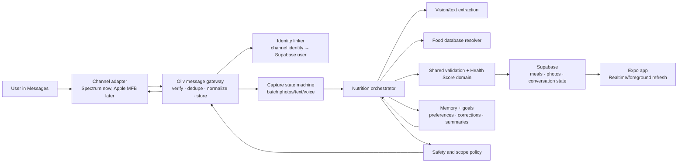

# Oliv as a message-first nutrition and health agent

Research date: July 23, 2026

## Executive recommendation

Oliv should become a **message-first nutrition agent with an app**, not an app that happens to have a chatbot.

The best near-term path is:

1. Use **Photon Spectrum** for a small iMessage pilot. Illume publicly discloses Photon and Spectrum as the processors for its Taro messaging feature, so this is the closest observable implementation analogue. Spectrum's free and Pro shared-line tiers are sufficient for a 10- to 100-person pilot.
2. In parallel, apply for **Apple Messages for Business** and evaluate an approved messaging service provider. Poke became the first standalone AI agent approved for this channel on June 4, 2026. Apple reportedly required Poke to identify the AI clearly and provide live-support fallback.
3. Put both behind an Oliv-owned channel adapter. The meal pipeline, user memory, safety policy, and Supabase writes must not depend on the messaging vendor.
4. Launch narrowly: photo/text/voice meal logging, corrections, daily totals, and opt-in check-ins. Do not start with a general-purpose “super agent.”
5. Default every message-created meal to **private**. Sharing to the social feed should be a deliberate second action.

The first technical spike should prove one thing end to end:

> An authenticated Oliv user texts one or more HEIC/JPEG meal photos, Oliv receives the actual image bytes, analyzes the meal, saves it exactly once to that user's account, replies with an editable summary, and the meal appears in the open app without a restart.

This is the critical path because Spectrum's webhook payload currently includes attachment metadata but not attachment bytes or a download URL. A long-lived Spectrum SDK connection appears to expose attachment readers/buffers, but that exact production flow must be tested before committing to the vendor.

## What Illume Labs supports

### Product and positioning

Illume describes itself as a “24/7 personal health companion” that combines wearables, nutrition, workouts, and lab results and returns personalized insights over text. It positions the product as a unifying intelligence layer over health data rather than another isolated tracker.

Its [YC launch](https://www.ycombinator.com/launches/RiI-illume-labs-your-24-7-personalized-health-companion) and [product site](https://www.illumelabs.ai/) currently advertise:

- automatic wearable sync for sleep, activity, and recovery;
- meal-photo logging over messages, without forms or barcode scans;
- workout recording and training-load tracking;
- bloodwork and lab-result upload, converted into longitudinal biomarkers;
- questions answered from the user's own history;
- proactive insights about changes, possible meaning, and next actions;
- cross-domain analysis, such as the relationship between late meals and sleep;
- generated plots and statistical analysis, including regression-style questions;
- quick answers in messages plus a deeper platform for trends and history.

Illume's examples are notably cross-domain:

- “Why am I so exhausted today?”
- “How has eating late affected my sleep?”
- “Am I recovering well enough to train?”
- “What should I focus on before my next blood test?”

The intended first users are lifters, biohackers, and longevity-oriented people already using wearables, blood panels, CGMs, nutrition trackers, or genetic tests. Genetic risk is described as a future direction, not a current shipped capability.

### Onboarding and commercial model

Illume's FAQ says:

- no wearable is required to start;
- users can connect any combination of nutrition, fitness, wearable, or lab data;
- the product is a wellness and longevity product, not a medical device;
- it does not diagnose, treat, or provide individualized medical advice;
- its paid private beta is $10/month with a 30-day money-back guarantee;
- its agent is named **Taro** and becomes more personalized over time.

Its privacy policy says the service is for adults 18 and older.

### Observable implementation stack

Illume's [privacy policy](https://www.illumelabs.ai/privacy) discloses more implementation detail than its marketing site:

| Layer | Disclosed provider or approach |
|---|---|
| Core database, storage, authentication | Supabase and cloud infrastructure |
| AI insights and assistant responses | Anthropic, with explicit user permission |
| Voice memo transcription | Deepgram |
| Message transport | Photon and Spectrum |
| Wearable aggregation | Terra |
| Direct wearable/provider support | Apple Health, WHOOP, Garmin, Fitbit, Oura, uploads |
| Product analytics | PostHog, optional in profile |
| Payments | Apple and Stripe |

The policy specifically says Photon and Spectrum process the user's phone number, message content, attachments, Illume replies, and delivery metadata for Taro messaging. This is strong evidence that Illume uses Photon's managed Spectrum infrastructure for its message agent.

Illume says its Apple Health connection is read-only and lists these requested data types:

- resting heart rate;
- heart-rate variability (SDNN);
- VO2 max;
- oxygen saturation;
- respiratory rate;
- sleep analysis;
- step count;
- active energy;
- exercise time;
- walking heart-rate average;
- body temperature.

It also says:

- AI processing is optional;
- analytics can be disabled;
- health values, messages, and uploaded content are not sent to PostHog;
- health data is not used for advertising, data brokers, or unrelated model training;
- raw wearable provider event payloads are scheduled for deletion after 30 days;
- historical normalized metrics remain until the user deletes them, the account, or requests deletion.

### What Illume does not substantiate publicly

The following are not demonstrated by the public material:

- clinical validation or measured accuracy of nutrition, lab interpretation, or causal claims;
- a named registered dietitian or physician review process;
- EHR/FHIR integrations;
- a current genetics integration;
- a HIPAA compliance claim or BAA availability;
- use of Apple's verified Messages for Business channel;
- the exact agent architecture, memory system, model prompts, or safety classifier;
- whether insights are causal, beyond the site's useful “pattern, not proof” language.

The correct product lesson is not merely “aggregate more data.” It is:

> Make capture effortless, preserve longitudinal context, connect domains, state uncertainty, and give the user one small next action.

## What Poke supports

### The message-first product

[Poke](https://poke.com/) works across Apple Messages, WhatsApp, Telegram, and other channels. It emphasizes:

- no new behavior to learn;
- a personable, concise texting style;
- persistent memory;
- connected services such as Gmail, Outlook, calendars, Notion, GitHub, Linear, and Oura;
- scheduled tasks and proactive automations;
- voice messages;
- reusable “Recipes” and custom integrations through MCP;
- a developer API that injects structured context into the same assistant conversation.

Poke's documented inbound API is revealing even though it is not its consumer message transport. Any JSON body posted to its API is forwarded to the agent as context, appears in the user's Poke conversation, and is processed like a user message. This implies a useful internal boundary:

```text
channel or event source → normalized message envelope → assistant runtime → tools → channel response
```

Oliv should adopt the same boundary.

### Poke Fit: the closest direct competitor to Oliv's first agent

[Poke Fit](https://poke.com/fit) is a calorie tracker in messages. It claims more than 67,000 people tracking calories and supports:

- natural-language meal and snack logging;
- calorie and macro estimates;
- multiple meals in a single message;
- daily and weekly totals and trends;
- goal-based daily calorie and macro targets;
- running “remaining today” calculations;
- reminders, check-ins, and accountability;
- rough portions without weighing, with optional detail for greater precision;
- Apple Messages, WhatsApp, and RCS;
- a free core tier and paid deeper personalization.

Its central UX loop is:

1. text what was eaten;
2. receive targets and a structured estimate;
3. receive proactive check-ins and accountability.

Poke's general site also shows an Oura integration and a user example describing plated-food or package-label nutrition from a photo. Poke's privacy policy covers uploaded images, audio, videos, files, and communications. However, the Poke Fit page itself documents text meal logging more clearly than photo logging, so photo-specific Fit behavior should not be assumed to have the same quality as Oliv's existing photo flow.

### Poke's official Apple Messages status

As of June 4, 2026, Poke is the first standalone AI agent approved on **Apple Messages for Business**, according to [TechCrunch](https://techcrunch.com/2026/06/04/apple-approves-poke-as-the-first-ai-agent-on-its-messages-for-business-platform/) and Poke's own [release notes](https://poke.com/docs/release-notes).

This distinction matters:

- Poke's current official experience is a verified business conversation inside Apple's Messages app.
- It is not an ordinary third-party iOS app receiving arbitrary personal iMessages through the Messages framework.
- TechCrunch reports that Apple required Poke to disclose clearly that it is AI and to be capable of live support.
- Poke advertises “verified chat with rich actions,” which comes from the business-messaging surface.

Poke has not publicly disclosed its Messages for Business service provider or its complete transport architecture.

### Poke's likely agent architecture: verified versus inferred

Poke has not published its internal agent implementation. The best technical description is [OpenPoke](https://www.shloked.com/writing/openpoke), a third-party reverse-engineering project by Shlok Khemani. It should be treated as an informed reconstruction, not as Poke's official architecture.

OpenPoke reconstructs:

- one **Interaction Agent** that owns the user-facing voice, context, routing, and final response;
- persistent **Execution Agents** that own specific work threads and their full operational histories;
- atomic tools for service actions;
- higher-level tasks that encapsulate complex service-specific tool use;
- SQL-backed one-time and recurring triggers;
- background monitors that decide when to interrupt the user;
- recent full-fidelity conversation history plus progressively compressed older history;
- external systems, especially email, as durable factual memory;
- asynchronous work that does not block the main conversation.

The valuable patterns for Oliv are:

- separate conversation style from deterministic execution;
- normalize every channel into one message model;
- let the user continue talking while slower work completes;
- store operational state outside the model;
- preserve a compact user profile and recent context, not an ever-growing prompt;
- make proactive messages selective and consented;
- use terse message-sized responses rather than dumping app screens into text.

The parts Oliv should not copy yet are:

- a swarm of persistent agents for a narrow meal-logging task;
- expensive multi-model loops for deterministic nutrition arithmetic;
- permanent raw operational memory without retention limits;
- a highly sarcastic tone in a health context;
- autonomous health actions without explicit scope and safety rules.

For the first Oliv agent, a typed state machine plus one conversational router is safer, faster, and cheaper than a general multi-agent system.

## The iMessage implementation landscape

“An iMessage agent” can mean several technically different things.

### 1. iMessage app extension

An iMessage extension is bundled with or installed alongside an iOS app. It can present custom UI inside Messages and help a user create content.

It cannot act as an always-on remote assistant. Apple's Messages framework says an extension can send only after recent user interaction and while it is visible. See Apple's documentation for [`sendWithoutRecentInteraction`](https://developer.apple.com/documentation/messages/msmessageerrorcode/sendwithoutrecentinteraction) and [`sendWhileNotVisible`](https://developer.apple.com/documentation/messages/msmessageerrorcode/sendwhilenotvisible).

Use an Oliv extension later for a “share this meal/photo to Oliv” affordance, not as the core agent transport.

### 2. Photon Spectrum managed iMessage

[Spectrum](https://photon.codes/docs/spectrum-ts/introduction) is an open-source TypeScript framework plus an optional hosted messaging layer. Its iMessage provider supports managed lines, DMs, groups, typing indicators, reactions, threaded replies, effects, attachments, and newer iOS features.

Current [pricing](https://photon.codes/pricing) is:

- Free: managed shared line, up to 10 users;
- Pro: $25/month, managed shared line, up to 100 users;
- Business: $250 per dedicated line per month, unlimited users with auto-scaling;
- Enterprise: custom dedicated infrastructure and numbers.

Important behavior:

- shared tiers can assign different fresh numbers to different users;
- the Business tier gives the project a dedicated number;
- Spectrum can use a long-lived gRPC stream or signed webhooks;
- webhook deliveries are HMAC signed and provide stable message IDs for idempotency;
- Spectrum's [webhook event documentation](https://photon.codes/docs/webhooks/events) says attachments include filename, MIME type, and size but currently omit file bytes and a download URL;
- actual attachment processing therefore requires the live SDK path or a vendor-supported retrieval mechanism;
- iMessage images commonly arrive as HEIC and must be normalized before Oliv's current analyzer, which accepts JPEG, PNG, and WebP.

Spectrum is the fastest route to a credible pilot and is the route Illume appears to use. It is not the same as becoming a verified Apple business. Because Apple does not offer a general public iMessage bot API, Oliv should complete vendor due diligence on deliverability, data retention, account suspension risk, security controls, and production support before launch.

### 3. Apple Messages for Business

[Apple Messages for Business](https://support.apple.com/en-us/102053) is the official business channel in Messages. It supports verified business identity, media, rich actions, Apple Pay, scheduling, and entry points from Maps, Safari, Siri, Search, websites, and apps.

Apple's [platform security guide](https://support.apple.com/guide/security/secure-apple-messages-for-business-sec1c603aab4/web) is important for identity design:

- the business does not receive the user's phone number, email, or Apple Account;
- Apple supplies an **Opaque ID** unique to the user/business relationship;
- the user controls whether to share identifying information;
- the user can end the conversation and block further messages;
- Apple says the Messages for Business service does not store conversation history.

Oliv would register its business with Apple and connect through an approved messaging service provider such as Twilio, Infobip, Genesys, Salesforce, or another current Apple partner. [Twilio's offering](https://www.twilio.com/en-us/messaging/channels/apple-messages-for-business) is still private beta as of this research, so availability and terms need direct confirmation.

Advantages:

- official Apple approval and verified branding;
- stable business semantics and rich actions;
- privacy-preserving Opaque ID;
- better long-term platform legitimacy.

Costs and constraints:

- business and use-case approval;
- a service-provider dependency;
- an AI disclosure and live-support plan, based on the Poke precedent;
- the user normally initiates the business conversation;
- business-style gray branded messages rather than ordinary peer blue bubbles;
- onboarding and approval timing are outside Oliv's control.

### 4. SMS/MMS and RCS fallback

SMS/MMS is the simplest universal fallback and supports meal photos through MMS, but it has lower media quality, carrier filtering, messaging-registration requirements, and no iMessage-native identity.

RCS adds richer media and verified business capabilities where supported. The channel adapter should leave room for it, but it should not delay the iOS pilot.

### Route comparison

| Route | Autonomous agent | Photo intake | Verified by Apple | Proactive messages | Best use |
|---|---:|---:|---:|---:|---|
| iMessage extension | No | User-selected only | App Store review | No | Share-to-Oliv helper |
| Photon Spectrum | Yes | Yes, SDK path must be proven | No business verification | Yes, vendor/platform limits apply | Fast pilot |
| Apple Messages for Business | Yes | Yes | Yes | Controlled by business-conversation rules | Production trust and reach |
| SMS/MMS | Yes | Yes | No | Yes, consent/carrier rules apply | Fallback and non-iPhone users |
| WhatsApp Business / RCS | Yes | Yes | Channel-specific | Channel-specific | Later multi-channel expansion |

## Recommended Oliv product

### Product promise

The first version should promise:

> Text Oliv what you ate — a photo, voice memo, or sentence. Oliv logs it, shows what it estimated, fixes mistakes in conversation, and keeps you gently on track.

It should not yet promise diagnosis, treatment, disease prevention, or a substitute for a licensed dietitian or physician.

### Core v1 jobs

1. **Log a meal**
   - one to five photos;
   - text description;
   - voice memo;
   - combined photo plus description;
   - multiple meals in one text when unambiguous.

2. **Correct a meal**
   - “that was two eggs, not one”;
   - “the dressing was light”;
   - “make that dinner private”;
   - “delete the snack I just logged.”

3. **Understand today**
   - calories and macros consumed and remaining;
   - protein/fiber or other selected focus;
   - concise uncertainty-aware suggestions;
   - no moral judgment for being over or under.

4. **Plan the next meal**
   - one or two realistic options based on remaining targets, preferences, schedule, and prior meals;
   - ask about allergies and dietary constraints during onboarding, not repeatedly.

5. **Maintain consistency**
   - opt-in meal reminders;
   - end-of-day summary;
   - weekly pattern review;
   - user-defined quiet hours and frequency.

### Conversation design

The best default exchange is:

```text
User: [photo] lunch

Oliv: got it — logging lunch

Oliv: chicken rice bowl
~690 cal · 48g protein · 76g carbs · 19g fat
health score 4.1/5

Oliv: I assumed about 1½ cups of rice. Reply “1 cup” or “2 cups” if that’s off.
```

Design rules:

- acknowledge within roughly one second with a reaction, typing state, or short text;
- send the useful result in message-sized chunks;
- ask at most one high-value clarification by default;
- distinguish an estimate from a measured value;
- state the largest assumption, not every uncertainty;
- make corrections conversational and reversible;
- include a deep link to the meal detail screen;
- default to private and offer “share to feed” as a separate action;
- use warm, direct language without shame, alarmism, or fake medical authority.

### Accuracy strategy

Oliv's existing vision-only estimate is a good capture layer, but it should not be the final nutrition source.

The stronger pipeline is:

1. vision/text model identifies foods, preparation, visible portions, and uncertainty;
2. a structured resolver maps foods to a nutrition database;
3. [USDA FoodData Central](https://fdc.nal.usda.gov/api-guide/) supplies reference and branded nutrition values where possible;
4. package labels and barcodes override visual estimates;
5. saved user foods, recipes, and prior corrections personalize future estimates;
6. the model estimates only what the database cannot determine;
7. deterministic validation and health scoring run after resolution;
8. the user sees and can correct the highest-impact assumptions.

Single-image portion estimation remains inherently uncertain. A review of image-assisted dietary assessment found that image capture is promising and reduces burden, but fully automated food recognition and portion estimation with acceptable precision is not yet guaranteed. See the [NIH-hosted review](https://pmc.ncbi.nlm.nih.gov/articles/PMC7686022/).

Oliv should optimize for **low-friction honest estimates**, not false precision.

Useful accuracy modes:

- **Fast:** log immediately with reasonable defaults;
- **Precise:** ask about high-impact portions, oils, sauces, and package serving size;
- **Repeat meal:** reuse the user's corrected prior meal or recipe.

## Architecture for Oliv



### Service boundaries

#### Channel adapter

Owns provider-specific receiving, sending, reactions, typing indicators, attachments, and delivery states. It emits one internal `MessageEnvelope`:

```ts
type MessageEnvelope = {
  provider: 'spectrum' | 'apple-mfb' | 'sms' | 'whatsapp';
  externalMessageId: string;
  externalConversationId: string;
  externalSenderId: string;
  receivedAt: string;
  text?: string;
  attachments: Array<{
    mimeType: string;
    filename?: string;
    bytesOrInternalUrl: unknown;
  }>;
};
```

Provider IDs must remain opaque strings. Do not build the identity model around a phone number; Apple's official channel intentionally does not reveal one.

#### Identity linker

Add an in-app **Connect Oliv in Messages** flow:

1. an authenticated user generates a short-lived, one-time linking token;
2. the user sends or opens that token in the Oliv conversation;
3. the gateway stores the provider, external sender ID, and Supabase user ID;
4. the token is hashed at rest, expires quickly, and can be consumed once;
5. the app shows linked channels and supports revoke/disconnect.

Do not store a user's long-lived Supabase access or refresh token in the message gateway. Use a narrowly scoped, server-only internal API with service-role access after the gateway verifies the channel identity and its own request signature.

#### Capture state machine

The gateway must not treat every incoming bubble as a separate meal. iPhone users often send several photos and then a caption.

A practical state machine:

- open a capture window on the first meal-like photo or text;
- collect up to five photos and adjacent text for 20–45 seconds;
- extend the window briefly when another attachment arrives;
- let explicit commands such as “done” close it immediately;
- classify a new timestamp/meal phrase as a separate meal;
- persist state so a gateway restart cannot lose the capture;
- use the original message time and the user's timezone for `loggedAt`.

#### Nutrition orchestrator

Keep business math out of the model. The model may:

- classify intent;
- extract food candidates and portions;
- identify missing high-impact information;
- write a concise explanation.

Tools should perform:

- `analyze_meal_draft`;
- `create_meal`;
- `update_meal`;
- `delete_meal`;
- `get_daily_summary`;
- `get_recent_meals`;
- `get_goals_and_preferences`;
- `schedule_check_in`;
- `share_meal`.

Mutating tools need idempotency keys, an audit record, and a reversible user-facing confirmation.

#### Shared domain package

The existing `src/domain/` is pure TypeScript and correctly owns nutrition validation, goals, summaries, and the normative Health Score.

The message server also needs exactly the same rules. Extract the domain modules into a platform-neutral shared package consumed by:

- the Expo app;
- Supabase functions;
- the message gateway;
- the existing reference tests.

Do not reimplement Health Score logic in prompts, SQL, or a separate server file.

#### Memory

Use typed stores instead of one large conversational memory:

- user profile: goals, body data, timezone, dietary pattern, allergies, dislikes;
- meal memory: recent meals, corrections, recipes, repeat orders;
- coaching preferences: tone, reminder schedule, focus metrics;
- recent conversation: a bounded full-fidelity window;
- older conversation: compact dated summaries;
- agent operations: immutable audit events with a retention policy.

The model should retrieve only the memory relevant to the current intent.

#### Safety

Create an explicit policy layer before calling the generative response:

- keep general wellness guidance separate from medical advice;
- never diagnose or change medication;
- detect urgent symptoms and route to an approved emergency response;
- avoid aggressive calorie deficits or unsafe targets;
- provide an eating-disorder-sensitive mode and avoid shame-based nudges;
- require human/clinical review before supporting diabetes, pregnancy, kidney disease, pediatric nutrition, or other higher-risk protocols;
- state evidence and uncertainty for cross-domain correlations;
- allow complete export, deletion, and message-channel disconnect.

Until counsel and licensed clinicians review the product, “nutrition coach” or “health companion” is safer positioning than presenting the software itself as a dietitian.

## Mapping to the current Oliv codebase

### Strong foundations to reuse

The current repository already has:

- a clean `app → components → store → services → domain` layering rule;
- a pure TypeScript domain layer;
- a normative, explainable, reference-tested Health Score;
- `validateAnalysis()` with clamping, macro-energy reconciliation, and nutrient caps;
- one-to-five-photo meals;
- a proxy analyzer with server-side OpenAI credentials;
- an offline deterministic fallback;
- UUID meal IDs and a durable client pending-operation log;
- Supabase Auth, Postgres, Storage, Row-Level Security, and account deletion;
- photo persistence and upload;
- a local-first app that can remain the deep-analysis surface.

This is substantially more reusable than starting a new agent backend.

### Gaps that block message-created meals

1. **No external channel identity**
   - Add provider-agnostic identity linking rather than mapping a phone number directly to a user.

2. **The analyzer requires an end-user Supabase JWT**
   - Add an internal signed ingestion API for the gateway. Do not give the gateway user refresh tokens.

3. **Agent-created meals bypass the local Zustand write path**
   - Add Supabase Realtime subscription or foreground refresh/reconciliation so server-created meals appear promptly in the app.

4. **Health Score currently assumes the client computes it**
   - Share the pure domain package with the gateway and server.

5. **iMessage commonly sends HEIC**
   - Normalize HEIC and other allowed media to bounded JPEG/WebP before analysis and storage.

6. **The current analyzer has a roughly 1.5 MB binary cap per base64 photo**
   - Resize/compress on the gateway before calling it, as the app already does.

7. **The meal-photo bucket is currently public-read**
   - This is already documented as an open production gap. Fix it before ingesting private health photos from messages: use a private bucket, signed URLs, and owner-checked delivery.

8. **No server-side capture/session state**
   - Add durable batching, deduplication, retry, and message-to-meal audit tables.

9. **No timezone in the profile**
   - Add an IANA timezone so “today,” reminders, and meal timestamps are correct.

10. **No analysis provenance or correction learning**
    - Store model/provider version, source message IDs, assumptions, and user correction history.

11. **Social defaults need a channel-specific rule**
    - Message-created meals should always start private even if the user's in-app default is public.

### Proposed schema additions

```sql
channel_identities (
  id uuid primary key,
  user_id uuid references profiles(id),
  provider text,
  external_sender_id text,
  external_conversation_id text,
  status text,
  linked_at timestamptz,
  revoked_at timestamptz,
  unique(provider, external_sender_id)
)

channel_link_tokens (
  id uuid primary key,
  user_id uuid references profiles(id),
  token_hash text,
  expires_at timestamptz,
  consumed_at timestamptz
)

agent_messages (
  id uuid primary key,
  provider text,
  external_message_id text,
  external_conversation_id text,
  user_id uuid references profiles(id),
  direction text,
  content_type text,
  received_at timestamptz,
  processing_status text,
  unique(provider, external_message_id)
)

meal_capture_sessions (
  id uuid primary key,
  user_id uuid references profiles(id),
  conversation_id text,
  state jsonb,
  closes_at timestamptz,
  committed_meal_id uuid references meals(id)
)

meal_message_links (
  meal_id uuid references meals(id),
  agent_message_id uuid references agent_messages(id),
  primary key(meal_id, agent_message_id)
)

meal_analysis_runs (
  id uuid primary key,
  meal_id uuid references meals(id),
  provider text,
  model text,
  prompt_version text,
  analysis_version text,
  assumptions jsonb,
  confidence_reasons jsonb,
  created_at timestamptz
)

meal_corrections (
  id uuid primary key,
  meal_id uuid references meals(id),
  user_id uuid references profiles(id),
  before jsonb,
  after jsonb,
  source_message_id uuid references agent_messages(id),
  created_at timestamptz
)

agent_nudges (
  id uuid primary key,
  user_id uuid references profiles(id),
  kind text,
  schedule jsonb,
  timezone text,
  enabled boolean,
  last_sent_at timestamptz
)
```

Apply Row-Level Security so users can view and revoke their own channel links, messages, captures, and nudges. Only the internal gateway role should create raw message events.

## Security, privacy, and regulatory posture

Oliv is likely not automatically covered by HIPAA merely because it stores consumer health data. HHS explains that a consumer-selected app is generally outside HIPAA unless it acts for a covered entity or business associate. See [HHS health-app guidance](https://www.hhs.gov/hipaa/for-professionals/special-topics/health-apps/index.html).

That does not make the data unregulated. The FTC's updated [Health Breach Notification Rule](https://www.ftc.gov/business-guidance/resources/complying-ftcs-health-breach-notification-rule-0) explicitly covers many health apps and gives the example of an app that collects consumer health data and syncs with a fitness tracker.

The 2026 FDA [General Wellness guidance](https://www.fda.gov/regulatory-information/search-fda-guidance-documents/general-wellness-policy-low-risk-devices) says software intended to maintain or encourage a healthy lifestyle, unrelated to diagnosis, cure, mitigation, prevention, or treatment of disease, may fall outside the device definition. Oliv should preserve that boundary until it intentionally pursues a regulated clinical product.

Apple's [App Review Guidelines](https://developer.apple.com/app-store/review/guidelines/) also prohibit using HealthKit and health/fitness data for advertising or unrelated data mining, require disclosure of collected health data, and prohibit storing personal health information in iCloud.

Before a public beta:

- make the photo bucket private;
- document every message, model, transcription, storage, and analytics processor;
- execute DPAs and determine whether BAAs are available or needed for future clinical partnerships;
- prohibit health-message content from advertising and unrelated model training;
- define raw attachment and message retention;
- encrypt in transit and at rest;
- separate operational telemetry from message content;
- create access, export, deletion, and channel-revocation flows;
- add an incident and health-data breach response plan;
- complete a threat model for account linking, spoofed senders, replayed webhooks, prompt injection in attachments, and service-role misuse;
- obtain legal review of nutrition/dietitian claims and automated outbound messaging consent.

## Phased build plan

### Phase 0: decisions and transport spike — 2 to 4 days

- Create a Spectrum test project on the free tier.
- Prove inbound HEIC/JPEG photo-byte access through the long-lived SDK.
- Measure receipt-to-acknowledgment and receipt-to-result latency.
- Test duplicate deliveries, restarts, reactions, typing, and outbound attachments.
- Ask Photon for production architecture, retention, security documentation, DPA/BAA posture, dedicated-line migration, throughput, and Apple/platform-risk terms.
- Register Oliv in Apple Business and begin a Messages for Business/MSP conversation in parallel.
- Decide where the stateful Node/Bun gateway will run; choose infrastructure with restart supervision and persistent outbound connectivity.

Exit criterion: a local test user can text a photo and receive its SHA-256, MIME type, and dimensions from the gateway.

### Phase 1: private vertical slice — about 1 week

- Add channel link tokens and channel identities.
- Add signed gateway-to-Supabase authentication.
- Normalize, resize, and store one photo privately.
- Reuse the existing analyzer and shared validation/Health Score logic.
- Insert an idempotent private meal.
- Reply with calories/macros/score, key assumption, and deep link.
- Add app foreground refresh or Realtime for server-created meals.
- Add “correct,” “delete,” and “make public/share” commands.
- Test with 5–10 internal users.

Exit criterion: 95%+ of valid photo/text meals complete exactly once and appear in the app without relaunch.

### Phase 2: meal-logging quality — 2 to 3 weeks

- Add multi-photo batching and text-after-photo capture windows.
- Add voice memo transcription.
- Add multiple-meals-in-one-message parsing.
- Add USDA FoodData Central grounding.
- Add saved meals, recipes, package labels, and correction reuse.
- Store provenance and high-impact assumptions.
- Add fast versus precise capture preferences.
- Build replayable end-to-end test fixtures from consented/synthetic messages.
- Add retry queues, dead-letter handling, delivery status, and operational dashboards.

Exit criterion: median log time below 15 seconds, duplicate rate below 0.1%, and material edit rate trending downward.

### Phase 3: nutrition coach — 3 to 5 weeks

- Add dietary preferences, allergies, timezone, schedule, and coaching tone.
- Add daily totals and next-meal suggestions.
- Add opt-in reminders, quiet hours, and weekly reviews.
- Add pattern detection that clearly distinguishes association from causation.
- Have a registered dietitian review prompts, recommendations, target floors, contraindications, and escalation copy.
- Add eating-disorder-sensitive controls and a non-calorie mode.
- Evaluate user trust, not only macro accuracy.

Exit criterion: users log on more days per week without an increase in correction burden or notification opt-outs.

### Phase 4: official Apple channel and health expansion — parallel

- Complete Messages for Business approval and service-provider integration.
- Preserve the Spectrum adapter as a pilot/fallback until official delivery is stable.
- Add Apple Health read-only integration.
- Add wearable data only after meal logging and coaching are reliable.
- Add labs and higher-risk health interpretation only with clinical governance, evidence standards, and revised regulatory review.

## Metrics

### Reliability

- inbound message acceptance rate;
- attachment retrieval success by MIME type;
- duplicate meal rate;
- time to first acknowledgment;
- time to completed analysis;
- gateway reconnect and retry rate;
- app synchronization delay;
- correction/delete success rate.

### Nutrition quality

- percentage of meals edited;
- magnitude of calorie/macro correction;
- percentage requiring clarification;
- repeated-meal accuracy after correction;
- database-grounded versus model-only items;
- confidence calibration;
- user-rated “close enough” rate.

### Product value

- median seconds to log;
- meals per active user per week;
- days logged per week;
- D7 and D30 retention;
- percentage using corrections;
- percentage reading daily/weekly summaries;
- reminder opt-in and opt-out rates;
- share-to-social conversion from private meals.

### Safety and trust

- medical-scope interception rate;
- unsafe-target prevention;
- eating-disorder-mode use;
- false-alarm/escalation review;
- privacy/deletion completion time;
- percentage of users who understand that numbers are estimates.

## Immediate backlog

The highest-priority engineering tickets are:

1. **Spike Spectrum inbound meal photos**, including HEIC, actual bytes, multiple attachments, reconnects, and duplicate delivery.
2. **Design account linking** around provider-opaque identities and one-time tokens.
3. **Make meal photos private** and switch the app to signed, owner-authorized URLs.
4. **Extract the pure domain package** so the gateway uses the same validation and Health Score tests.
5. **Add server-created-meal synchronization** to the Expo app.
6. **Add idempotent internal meal ingestion** with service-role isolation and an audit log.
7. **Implement the capture state machine** for one-to-five photos plus adjacent text.
8. **Add correction commands** before adding proactive coaching.
9. **Start Apple Messages for Business approval** and document the live-support/AI-disclosure plan.
10. **Review health privacy and claims** before any external beta.

## Source list

### Illume

- [Illume product site](https://www.illumelabs.ai/)
- [Illume YC launch](https://www.ycombinator.com/launches/RiI-illume-labs-your-24-7-personalized-health-companion)
- [Illume privacy policy](https://www.illumelabs.ai/privacy)

### Poke

- [Poke product site](https://poke.com/)
- [Poke Fit](https://poke.com/fit)
- [Poke FAQs](https://poke.com/faq)
- [Poke API](https://poke.com/docs/api)
- [Poke release notes](https://poke.com/docs/release-notes)
- [TechCrunch: Poke's Apple Messages for Business approval](https://techcrunch.com/2026/06/04/apple-approves-poke-as-the-first-ai-agent-on-its-messages-for-business-platform/)
- [OpenPoke reverse-engineering](https://www.shloked.com/writing/openpoke)

### Messaging and Apple

- [Apple iMessage apps and Messages for Business overview](https://developer.apple.com/imessage/)
- [Apple Messages for Business user guide](https://support.apple.com/en-us/102053)
- [Apple Messages for Business platform security](https://support.apple.com/guide/security/secure-apple-messages-for-business-sec1c603aab4/web)
- [Apple Messages framework](https://developer.apple.com/documentation/messages)
- [Photon Spectrum introduction](https://photon.codes/docs/spectrum-ts/introduction)
- [Photon Spectrum pricing](https://photon.codes/pricing)
- [Photon Spectrum webhook events and attachment limitation](https://photon.codes/docs/webhooks/events)
- [Spectrum open-source repository](https://github.com/photon-hq/spectrum-ts)
- [Twilio Apple Messages for Business](https://www.twilio.com/en-us/messaging/channels/apple-messages-for-business)

### Nutrition, privacy, and regulation

- [USDA FoodData Central API](https://fdc.nal.usda.gov/api-guide/)
- [NIH review of image-assisted dietary assessment](https://pmc.ncbi.nlm.nih.gov/articles/PMC7686022/)
- [FDA General Wellness guidance, January 2026](https://www.fda.gov/regulatory-information/search-fda-guidance-documents/general-wellness-policy-low-risk-devices)
- [FTC Health Breach Notification Rule guidance](https://www.ftc.gov/business-guidance/resources/complying-ftcs-health-breach-notification-rule-0)
- [HHS resources for health-app developers](https://www.hhs.gov/hipaa/for-professionals/special-topics/health-apps/index.html)
- [Apple App Review Guidelines](https://developer.apple.com/app-store/review/guidelines/)
